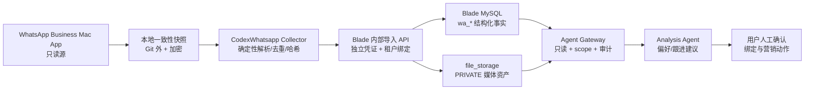

# ROM/SOW：WhatsApp Mac 本地归档与 Blade ERP 集成 v1

> 日期：2026-08-24  
> 分支：`feature/whatsapp-local-archive`  
> 任务：`BE-564`、`BE-566`～`BE-571`  
> 状态：边界已锁定，按 SOW 分阶段实施  
> 相关设计：[10-AGENT_INTEGRATION_DESIGN.md](../../10-AGENT_INTEGRATION_DESIGN.md)

## 一、背景与已验证事实

用户当前继续使用原 WhatsApp Business 号码和 Mac App，不需要自动回复。目标是把客户沟通数据安全归档到本地，再与 BladeProject 的客户、订单、商品和库存事实结合，供 Agent 生成客户偏好和跟进建议。

2026-08-24 已对本机 WhatsApp Business 做只读抽样，确认：

- Mac App 本地存在可读的 `ChatStorage.sqlite`、`ContactsV2.sqlite`、`Labels.sqlite` 和 `Biz/Biz.sqlite`。
- 当前约有 1,210 个会话、124,000 条源消息行和 1,100 个联系人；这些数字只用于容量估算，不进入仓库。
- 抽样联系人首次扫描得到 399 个源行、208 条逻辑消息；媒体重新下载后逻辑消息增至 224 条，其中 117 条文本、107 条非文本。
- 同一逻辑消息可能对应多个 CoreData 源行；仅用源主键或最大主键增量会重复或漏掉旧行更新。
- 已下载媒体可由数据库相对路径定位；抽样包含 JPEG、MP4 和 OGG。文件缺失不能阻断文本导入。
- `Labels.sqlite` 当前没有标签数据；标签模型本轮不落表，避免为未验证数据过度设计。
- 私聊 JID 同时存在 `s.whatsapp.net` 和 `lid`；v1 必须通过联系人库解析 LID，并显式排除 status、群组、频道和广播，不能把“只接私聊”误写成“只接手机号 JID”。
- WhatsApp 本地数据库结构属于 App 内部实现，版本升级可能变化，采集器必须识别 schema，不认识时停止导入。

以上验证只证明当前 Mac 版本可做个人设备上的本地归档，不代表 WhatsApp 官方承诺该数据库接口稳定。

## 二、目标

1. 对 WhatsApp Mac 数据库和媒体做一致、可恢复、只读的本地归档。
2. 在 Blade MySQL 中建立租户隔离的 WhatsApp 结构化事实层。
3. 幂等导入 1:1 联系人、会话、逻辑消息和已下载媒体，支持旧消息媒体后补。
4. 通过规范化电话号码把 WhatsApp 联系人与现有 CRM 客户建立候选或人工确认绑定。
5. Agent 后续只能通过受控的只读 Gateway 获取必要沟通事实或摘要，并结合 ERP 数据生成建议。
6. 为未来 WhatsApp Business Platform 保留替换数据源的空间，不要求更换号码。

## 三、本轮明确排除

- 不接入 WhatsApp Business Platform，不更换号码。
- 不自动回复、不自动发送营销消息、不代替用户联系客户。
- 不读取或修改 iPhone 数据；不修改、注入或锁定 WhatsApp Mac 在线数据库。
- 不导入群聊、状态、通话记录、支付记录和端到端密钥。
- 不自动创建 `crm_customer`，不自动覆盖 CRM 姓名、电话、地址或人工标签。
- 不让 Agent 直连 WhatsApp SQLite、原始快照或 Blade MySQL。
- 不在本轮实现偏好模型、跟进推荐模型、向量检索、全文检索或营销执行工作流。
- 不把真实聊天正文、电话号码、媒体或数据库快照提交到 Git。
- 不操作生产数据库、NAS 或生产容器。

发现排除项阻塞时，停止扩大范围，建立独立需求后再开发。

## 四、系统边界与数据流

### 4.1 双层存储

| 层 | 位置 | 内容 | 用途 |
|---|---|---|---|
| 原始归档层 | `~/Library/Application Support/BladeWhatsAppArchive/`（建议） | SQLite 一致性快照、manifest、校验哈希、已下载媒体副本 | 恢复、重放、审计；不供 Agent 直接访问 |
| 结构化事实层 | Blade MySQL + 文件中心 | 标准化联系人、会话、逻辑消息、源行引用、媒体元数据和 CRM 绑定 | ERP 查询、受控分析和后续 Agent Gateway |

原始归档目录必须位于 Git 外，并依赖 FileVault 或等价磁盘加密。MySQL 不保存本机绝对路径、macOS 用户名、加密密钥或无关 CoreData 字段。

### 4.2 时间与编码

- 原始时间无损保存为 `source_timestamp_ms BIGINT`。
- `sent_at`、批次时间和审计时间统一写 UTC `DATETIME(3)`；展示层按租户时区转换。
- 字符集统一 `utf8mb4`，JID 列最长 `VARCHAR(191)`。
- 电话标准形式为 E.164 digits-only，例如 `8613800000000`；原始号码不用于 CRM 匹配。

## 五、数据、权限与保留规则

1. `wa_*` 全部是普通多租户业务表，必须包含 `tenant_id`，不得加入 MyBatis-Plus tenant ignore list。
2. Collector 凭证与 Agent Key 分离。导入凭证只能写绑定租户的 WhatsApp 导入接口；Agent Key 只能读取授权事实。
3. 后台导入必须显式设置并在请求结束清理 `TenantContext`，禁止依赖默认 tenant=1。
4. 日志默认不输出消息正文、完整电话号码、媒体、token、本机路径；只记录 ID、计数、状态和脱敏错误。
5. 原始快照建议默认保留 90 天，结构化消息默认长期保留，最终期限由用户在上线前确认；删除必须先有可审计策略。
6. `source_deleted` 和 `is_revoked` 表达 WhatsApp 源事实；通用 `deleted` 只表达 ERP 管理侧隐藏，源端暂时缺行不得触发 ERP 删除。
7. Agent 默认不返回完整电话、全量正文或原图。需要消息正文的接口必须有独立 scope、分页、时间范围和调用审计。

## 六、数据库设计

### 6.1 共通规则

- 新增迁移暂定 `V43__whatsapp_archive.sql`；执行前再次确认最高 Flyway 版本。
- 只新增 `wa_*` 表，不修改 V1～V42，不在首个迁移中 ALTER CRM 或文件中心。
- 所有新表统一包含 `id BIGINT AUTO_INCREMENT`、`tenant_id BIGINT NOT NULL`、`create_by BIGINT NULL`、`create_time DATETIME(3)`、`update_time DATETIME(3)`、`deleted TINYINT NOT NULL DEFAULT 0`，满足项目表规范。批次和源引用虽然保留软删除字段，但应用层按 append/upsert 审计事实管理，不提供删除动作。
- 项目现有迁移基本不使用物理外键；本模块也不加 FOREIGN KEY。服务层必须用 `tenant_id + id` 校验引用归属。
- SHA-256 使用 `BINARY(32)`；API 以 64 位十六进制传输。
- 自然唯一键不包含 `deleted`；重新出现的数据 upsert/恢复原行，避免产生重复历史壳。

### 6.2 `wa_account`：数据源账号

| 字段 | 类型 | 必填 | 说明 |
|---|---|---:|---|
| id | BIGINT | 是 | 主键 |
| tenant_id | BIGINT | 是 | 租户 |
| source_type | VARCHAR(20) | 是 | `MAC_APP`，预留 `BUSINESS_PLATFORM` |
| account_jid | VARCHAR(191) | 是 | 源账号 JID |
| phone_normalized | VARCHAR(32) | 否 | digits-only |
| display_name | VARCHAR(100) | 否 | 账号显示名 |
| app_version | VARCHAR(32) | 否 | 源 App 版本 |
| source_instance_hash | BINARY(32) | 否 | 本地实例匿名指纹，不保存设备明文 |
| last_success_batch_id | BIGINT | 否 | 最近成功批次 |
| last_sync_time | DATETIME(3) | 否 | 最近成功同步时间 |
| status | TINYINT | 是 | 1 启用，0 停用 |
| create_by/create_time/update_time/deleted | 标准字段 | 是/否 | 审计和软删除 |

唯一键：`(tenant_id, source_type, account_jid)`。索引：`(tenant_id, status, deleted)`。

### 6.3 `wa_import_batch`：导入批次审计

| 字段 | 类型 | 说明 |
|---|---|---|
| id, tenant_id, account_id | BIGINT | 主键、租户、账号 |
| batch_no | VARCHAR(64) | Collector 生成的幂等批次号 |
| snapshot_at | DATETIME(3) | 快照时点 |
| source_app_version | VARCHAR(32) | App 版本 |
| chat_schema_hash/contact_schema_hash | BINARY(32) | schema 指纹 |
| status | VARCHAR(20) | `RUNNING/SUCCEEDED/PARTIAL/FAILED` |
| source_row_count | BIGINT | 扫描源行数 |
| logical_message_count | BIGINT | 逻辑消息数 |
| inserted_count/updated_count/duplicate_count/error_count | BIGINT | 结果计数 |
| manifest_json | JSON | 白名单 manifest，不含绝对路径和正文 |
| error_summary | VARCHAR(1000) | 脱敏错误摘要 |
| started_at/completed_at/create_time | DATETIME(3) | 批次生命周期 |

批次为 append-only 审计事实，保留通用 `deleted` 字段但不提供删除动作。唯一键：`(tenant_id, batch_no)`；索引：`(tenant_id, account_id, started_at)`、`(tenant_id, status, started_at)`。

### 6.4 `wa_sync_cursor`：扫描水位

| 字段 | 类型 | 说明 |
|---|---|---|
| id, tenant_id, account_id | BIGINT | 主键、租户、账号 |
| source_database | VARCHAR(32) | 如 `CHAT_STORAGE` |
| source_entity | VARCHAR(64) | 如 `ZWAMESSAGE` |
| last_source_pk | BIGINT | 仅用于缩小扫描范围 |
| last_scan_at | DATETIME(3) | 最近扫描时间 |
| state_json | JSON | 版本化扫描状态 |
| create_by/create_time/update_time/deleted | 标准字段 | 审计字段；不提供删除动作 |

唯一键：`(tenant_id, account_id, source_database, source_entity)`。该表不是正确性依据；每轮必须包含可配置回看窗口，并用 `source_opt + row_hash` 检查旧行更新。

### 6.5 `wa_contact`：WhatsApp 联系人

| 字段 | 类型 | 说明 |
|---|---|---|
| id, tenant_id, account_id | BIGINT | 主键、租户、来源账号 |
| contact_jid | VARCHAR(191) | 联系人主 JID |
| lid_jid | VARCHAR(191) | 可选 LID |
| phone_normalized | VARCHAR(32) | digits-only，用于候选匹配 |
| display_name/push_name/business_name | VARCHAR(191) | 不同来源名称，互不覆盖 |
| about_text | VARCHAR(500) | About 简介 |
| is_business | TINYINT | 是否有业务资料 |
| profile_file_id | BIGINT | 可选头像 fileId，本轮不要求导入 |
| first_seen_at/last_seen_at | DATETIME(3) | 首末观察时间 |
| raw_metadata | JSON | 仅白名单业务资料 |
| create_time/update_time/deleted | 标准字段 | 审计和软删除 |

唯一键：`(tenant_id, account_id, contact_jid)`。索引：`(tenant_id, phone_normalized, deleted)`、`(tenant_id, account_id, last_seen_at)`。

### 6.6 `wa_customer_binding`：CRM 客户绑定

| 字段 | 类型 | 说明 |
|---|---|---|
| id, tenant_id, wa_contact_id, customer_id | BIGINT | 主键、租户和两端对象 |
| match_method | VARCHAR(20) | `EXACT_PHONE/MANUAL` |
| confidence | DECIMAL(5,4) | 匹配置信度 |
| status | VARCHAR(20) | `PENDING/CONFIRMED/REJECTED` |
| confirmed_by/confirmed_at | BIGINT / DATETIME(3) | 人工确认审计 |
| note | VARCHAR(500) | 原因或备注 |
| create_time/update_time/deleted | 标准字段 | 审计和软删除 |

唯一键：`(tenant_id, wa_contact_id)`。索引：`(tenant_id, customer_id, status, deleted)`、`(tenant_id, status, create_time)`。

只有租户内恰好一个规范化号码命中时才建立 `PENDING` 候选；零匹配或多匹配均等待人工处理。系统不得自动新建或修改 CRM 客户。

### 6.7 `wa_conversation`：会话

| 字段 | 类型 | 说明 |
|---|---|---|
| id, tenant_id, account_id | BIGINT | 主键、租户、来源账号 |
| contact_id | BIGINT | 1:1 联系人；允许暂未解析 |
| source_session_pk | BIGINT | 本地会话源主键，仅追溯 |
| conversation_jid | VARCHAR(191) | 会话自然标识 |
| conversation_type | VARCHAR(16) | v1 只允许 `DIRECT` |
| title | VARCHAR(255) | 会话标题 |
| first_message_at/last_message_at | DATETIME(3) | 消息范围 |
| message_count | BIGINT | 逻辑消息计数 |
| unread_count | INT | 快照时未读数 |
| archived/hidden | TINYINT | 源会话状态 |
| last_sync_time | DATETIME(3) | 最近同步 |
| raw_metadata | JSON | 白名单会话属性 |
| create_time/update_time/deleted | 标准字段 | 审计和软删除 |

唯一键：`(tenant_id, account_id, conversation_jid)`。索引：`(tenant_id, contact_id, last_message_at)`、`(tenant_id, account_id, last_message_at)`。

### 6.8 `wa_message`：逻辑消息

| 字段 | 类型 | 说明 |
|---|---|---|
| id, tenant_id, account_id, conversation_id | BIGINT | 主键与归属 |
| contact_id | BIGINT | 可选联系人冗余，便于客户时间线 |
| external_message_id | VARCHAR(191) | WhatsApp stanza id，可空 |
| logical_key_hash | BINARY(32) | 版本化逻辑去重键 |
| direction | VARCHAR(12) | `INBOUND/OUTBOUND/SYSTEM` |
| sender_jid | VARCHAR(191) | 发送方；群聊后续使用 |
| message_type | VARCHAR(32) | `TEXT/IMAGE/VIDEO/AUDIO/DOCUMENT/...` |
| source_message_type | INT | 源枚举值，便于适配升级 |
| mapping_version | VARCHAR(16) | 消息类型与逻辑键映射版本 |
| text_content | LONGTEXT | 文本或 caption；按权限访问 |
| source_timestamp_ms | BIGINT | 原始毫秒时间 |
| sent_at | DATETIME(3) | UTC 查询时间 |
| status | VARCHAR(20) | 源状态归一化值 |
| is_starred | TINYINT | 是否星标 |
| reply_to_external_id/reply_to_message_id | VARCHAR(191) / BIGINT | 回复关系 |
| content_hash | BINARY(32) | 规范化内容哈希 |
| first_seen_batch_id/last_seen_batch_id | BIGINT | 批次追溯 |
| is_revoked/revoked_at/source_deleted | TINYINT / DATETIME(3) | 源撤回与删除事实 |
| raw_metadata | JSON | 仅白名单源属性 |
| create_time/update_time/deleted | 标准字段 | 审计和 ERP 隐藏 |

唯一键：`(tenant_id, account_id, logical_key_hash)`。索引：`(tenant_id, conversation_id, sent_at, id)`、`(tenant_id, contact_id, sent_at, id)`、`(tenant_id, account_id, external_message_id)`。v1 不创建 FULLTEXT 索引。

### 6.9 `wa_message_source_ref`：源行映射

| 字段 | 类型 | 说明 |
|---|---|---|
| id, tenant_id, account_id, message_id | BIGINT | 主键与逻辑消息 |
| source_database/source_entity | VARCHAR(32)/VARCHAR(64) | 源库和源实体 |
| source_pk | BIGINT | CoreData 主键 |
| source_opt | INT | CoreData 行版本 |
| source_sort | BIGINT | 源排序值 |
| row_hash | BINARY(32) | 白名单字段规范化哈希 |
| first_seen_batch_id/last_seen_batch_id | BIGINT | 批次追溯 |
| source_missing/missing_since_batch_id | TINYINT / BIGINT | 完整成功扫描后发现源行缺失；不物理删除 |
| create_time/update_time | DATETIME(3) | 审计时间 |

该表为 upsert 审计映射，保留通用 `deleted` 字段但不提供删除动作。唯一键：`(tenant_id, account_id, source_database, source_entity, source_pk)`；索引：`(tenant_id, message_id)`、`(tenant_id, account_id, last_seen_batch_id)`。

### 6.10 `wa_message_media`：消息媒体

| 字段 | 类型 | 说明 |
|---|---|---|
| id, tenant_id, message_id | BIGINT | 主键与逻辑消息 |
| media_key_hash | BINARY(32) | 消息内媒体稳定键 |
| file_id | BIGINT | 导入文件中心后的 fileId |
| media_type/mime_type | VARCHAR(20)/VARCHAR(100) | 归一化类型和 MIME |
| original_name | VARCHAR(255) | 原文件名，不含绝对路径 |
| file_size | BIGINT | 文件大小 |
| file_hash | BINARY(32) | 实际文件 SHA-256 |
| caption | TEXT | 媒体说明 |
| duration_ms | BIGINT | 音视频时长 |
| width/height | INT | 图像或视频尺寸 |
| source_relative_path | VARCHAR(500) | 相对路径；禁止用户名和绝对路径 |
| download_status | VARCHAR(20) | `METADATA_ONLY/AVAILABLE/IMPORTED/MISSING/FAILED` |
| error_message | VARCHAR(500) | 脱敏错误 |
| first_seen_batch_id/last_seen_batch_id | BIGINT | 批次追溯 |
| create_time/update_time/deleted | 标准字段 | 审计和软删除 |

唯一键：`(tenant_id, message_id, media_key_hash)`。索引：`(tenant_id, file_id)`、`(tenant_id, download_status, update_time)`。

媒体导入成功后使用：`file_storage.source=whatsapp`、`purpose=customer_chat`、`visibility=PRIVATE`，并写 `file_business_bind.business_type=whatsapp_message`、`bind_role=attachment`。现有文件上传服务尚未计算 `file_hash`，OGG/PDF 也不在当前白名单，因此必须由 BE-569 独立补齐，不能假定已经支持。

## 七、源字段映射与幂等算法

### 7.1 主要源映射

| 源 | 字段 | 目标 |
|---|---|---|
| `ZWACHATSESSION` | `Z_PK`, `ZCONTACTJID`, `ZPARTNERNAME`, `ZLASTMESSAGEDATE`, `ZARCHIVED`, `ZHIDDEN`, `ZUNREADCOUNT` | `wa_conversation` |
| `ZWAMESSAGE` | `Z_PK`, `Z_OPT`, `ZCHATSESSION`, `ZISFROMME`, `ZMESSAGETYPE`, `ZMESSAGESTATUS`, `ZSORT`, `ZMESSAGEDATE`, `ZSENTDATE`, `ZFROMJID`, `ZTOJID`, `ZSTANZAID`, `ZTEXT`, `ZMEDIAITEM` | `wa_message` + `wa_message_source_ref` |
| `ZWAMEDIAITEM` | `Z_PK`, `ZMESSAGE`, `ZFILESIZE`, `ZMOVIEDURATION`, `ZASPECTRATIO`, `ZMEDIALOCALPATH`, `ZTHUMBNAILLOCALPATH`, `ZTITLE`, `ZVCARD*` | `wa_message_media` |
| `ZWAADDRESSBOOKCONTACT` | 名称、号码、WhatsApp ID、About 白名单字段 | `wa_contact` |
| `Biz.sqlite` | verified name、描述、地址、邮箱、网站、营业时间、时区 | `wa_contact.raw_metadata` 白名单 |

任何新 App 版本出现未知 schema hash 时必须 fail closed：生成失败批次和脱敏报告，不猜测列语义。

`ZMEDIAKEY`、远端临时媒体 URL、端到端密钥及其他加密材料不进入归档 API 或 Blade MySQL；Biz 内部 BLOB（网站/营业时间等）在未验证解析规则前也不反序列化。

### 7.2 一致性快照

1. Collector 对源数据库以 read-only URI 打开。
2. 使用 SQLite Backup API 为每个数据库生成事务一致的临时快照，不复制半写入的 WAL 状态。
3. 计算文件 hash、schema hash、行数和快照时点，写 manifest。
4. 仅解析快照，不长时间扫描 App 在线数据库。
5. 临时文件原子移动到按日期/批次组织的归档目录；失败不得覆盖上次成功快照。

四个 SQLite 数据库之间无法形成一个跨库事务：`ChatStorage.sqlite` 是消息事实主库，Contacts、Biz 和 Labels 是最终一致的补充源。manifest 必须分别记录每个库的快照开始/完成时间，不得声称四库同一时点原子一致。

### 7.3 逻辑去重

- 有 `ZSTANZAID`：逻辑键版本 + account JID + conversation JID + stanza id + direction + source timestamp。
- 无 `ZSTANZAID`：逻辑键版本 + account JID + conversation JID + direction + sender JID + source timestamp + content hash。
- 所有字段以明确的 UTF-8、空值和分隔规则 canonicalize 后计算 SHA-256。
- 多个 `ZWAMESSAGE` 行可以映射到同一 `wa_message`，每个源行分别写 `wa_message_source_ref`。
- 同一快照重复导入必须新增 0 条逻辑消息；失败重试不得增加重复行。

### 7.4 增量和旧行更新

- v1 对约 124k 消息源行执行按 `Z_PK` keyset 分页的完整流式扫描，并比较 `Z_OPT` 与 `row_hash`；该规模优先保证正确性。
- `wa_sync_cursor.last_source_pk` 只为后续优化预留，不允许在 v1 跳过完整扫描。
- 只有完整扫描成功后，才把本批未出现的 source ref 标记 `source_missing`；不物理删除逻辑消息。
- 旧消息补下载媒体时更新 `source_ref` 和 `wa_message_media`，不新增 `wa_message`。
- 文件缺失写 `MISSING`，文本和消息元数据照常提交；后续批次可补齐。

## 八、内部导入 API 契约

v1 计划接口，最终路径可在 BE-567 中按现有安全配置微调：

| 接口 | 用途 | 幂等键 |
|---|---|---|
| `POST /api/internal/whatsapp/import/batches` | 创建/恢复导入批次 | `batchNo` |
| `POST /api/internal/whatsapp/import/contacts:upsert` | 批量联系人 upsert | account + contactJid |
| `POST /api/internal/whatsapp/import/conversations:upsert` | 批量会话 upsert | account + conversationJid |
| `POST /api/internal/whatsapp/import/messages:upsert` | 逻辑消息和源引用批量 upsert | logicalKeyHash + sourceRef |
| `POST /api/internal/whatsapp/import/media:upsert` | 媒体元数据/文件导入 | message + mediaKeyHash |
| `POST /api/internal/whatsapp/import/batches/{batchNo}:complete` | 提交批次结果 | batchNo + terminal state |

规则：

- 单请求限制记录数和总字节数；过大批次分块。
- 请求由独立 Collector 凭证认证并绑定 tenant/account；请求体不能决定 tenant。
- 服务端重新计算或验证关键哈希，拒绝跨租户 customerId/fileId/messageId。
- 单块事务失败整体回滚；整个批次允许 `PARTIAL` 后从幂等键继续。
- 返回固定 DTO，不返回 `Map`；错误按记录索引给出脱敏代码。

## 九、Agent 与人员分工

### 9.1 开发阶段 Agent

| 角色 | 负责 | 禁止/边界 |
|---|---|---|
| Codex（技术负责人） | 锁定 PRD/SOW；Blade schema、migration、内部 API、租户与安全；Diff 审查；独立测试；文档收口 | 不读取或提交真实客户内容；不操作生产 |
| DeepSeek/第二开发 Agent | `CodexWhatsapp` 采集器、SQLite schema adapter、快照/manifest、增量、媒体解析及测试 fixture | 不同时编辑 Blade migration/API；开始前必须单独认领任务 |
| 独立审查 Agent | 只读检查隐私、幂等、租户隔离、schema 与测试缺口 | 不直接合并，不替代 Codex 验收 |

同一任务若协作，必须在 TASKS 标明文件边界；Git、TASKS、CHANGELOG 和 SESSION_CONTEXT 是交接事实源。

### 9.2 运行阶段职责

| 角色 | 职责 |
|---|---|
| Collector | 确定性读取、快照、标准化、哈希和导入；不是 LLM |
| Analysis Agent | 只读消费 Gateway，把聊天事实与订单/商品/库存事实合并，输出偏好、跟进时机、依据和置信度 |
| 用户 | 确认 CRM 绑定、数据保留、建议是否采纳以及是否联系客户 |

v1 中只有用户可以决定营销动作；Agent 不发送消息、不修改人工标签、不创建订单。

## 十、分阶段 SOW

### SOW-0：方案与边界锁定 `BE-564`

- 完成本 ROM/SOW、PRD、Agent 设计、需求记录和任务拆分。
- 验证本机源数据可读、媒体回填和逻辑重复特征。
- 独立审查数据库、多租户、文件中心、采集器和文档治理。

验收：文档之间无边界冲突；真实客户数据未进入 Git；后续任务可独立认领。

### SOW-1：MySQL 事实层 `BE-566`

- 新增 `V43__whatsapp_archive.sql`，建立本计划 9 张表。
- 增加 migration 结构测试或数据库元数据断言。
- 不增加 Controller，不导入真实数据。

验收：V1→最新累计迁移和 V42→V43 均成功；表、字段、唯一键和租户索引与 SOW 一致；重复 migration 校验通过。

### SOW-2：导入鉴权与批次 API `BE-567`

- 设计独立 Collector credential/HMAC，绑定 tenant、account、scope 和有效期。
- 实现 batch 生命周期、请求 DTO 校验、幂等与审计。
- 日志脱敏，限制 payload 和批量大小。

### SOW-3：联系人与 CRM 绑定 `BE-568`

- 联系人、会话 upsert。
- 电话规范化和租户内唯一精确匹配。
- 候选确认/拒绝 API；不自动创建 CRM 客户。

### SOW-4：消息与媒体导入 `BE-569`

- 逻辑消息、源引用和媒体幂等 upsert。
- 旧行更新、撤回/删除事实和缺失媒体重试。
- 媒体 SHA-256、MIME 校验、OGG/PDF 边界、PRIVATE 文件与业务绑定。

### SOW-5：Mac Collector `BE-570`

- 在 `/Users/chenjiarun/Documents/CodexWhatsapp` 建立独立采集器项目。
- schema adapter、SQLite Backup、manifest、fixture、增量扫描、逻辑去重、媒体复制和受控上传。
- 默认 dry-run；真实导入必须显式配置目标租户与账号并由用户触发。

### SOW-6：只读查询与 Agent 上下文 `BE-571`

- 提供按已绑定客户、时间范围分页的沟通时间线/摘要事实接口。
- 单独 scope、脱敏、审计和限流；默认不返回全量正文和媒体。
- 分析和推荐表在导入正确性验收后另开任务，不在本 SOW 建表。

## 十一、测试矩阵

| 场景 | 预期 |
|---|---|
| WhatsApp 正在写入时快照 | SQLite Backup 生成一致快照，源库无写操作 |
| 未知 schema hash | fail closed，记录失败批次，不猜字段 |
| 抽样客户首次导入 | 逻辑消息数与确认基准一致，方向/时间/文本/媒体抽查一致 |
| 同一快照导入两次 | 第二次 `inserted_count=0` |
| 多个源行代表同一消息 | 1 条 `wa_message` + 多条 source ref |
| 旧消息后补图片/语音 | 只更新 source ref/media，不新增 message |
| 媒体文件缺失 | 消息成功，媒体为 `MISSING`，后续可补 |
| 导入中断后重试 | 从幂等键继续，不重复，不丢批次审计 |
| 同号码跨租户 | 数据互不冲突、不可跨租户绑定 |
| CRM 精确唯一号码 | 只生成 `PENDING` 候选 |
| CRM 零匹配或多匹配 | 等待人工绑定 |
| 非当前租户 customer/file/message ID | 拒绝并回滚当前块 |
| 无正文 scope 的 Agent | 不返回正文、完整电话和媒体 |
| 日志审查 | 无正文、完整电话、本机路径、凭证明文 |
| Flyway 累计迁移 | 空库 V1→最新及 V42→V43 成功 |

## 十二、允许和禁止的文件范围

### 允许

- `docs/02-PRD.md`
- `docs/03-TASKS.md`
- `docs/04-REQUISITION_LOG.md`
- `docs/05-CHANGELOG.md`
- `docs/10-AGENT_INTEGRATION_DESIGN.md`
- `docs/SESSION_CONTEXT.md`
- `docs/STATUS.md`
- `docs/superpowers/plans/2026-08-24-whatsapp-local-archive-rom-sow.md`
- `blade-backend/src/main/resources/db/migration/` 中新增 migration
- 后续 SOW 明确列出的 `com.blade.whatsapp`、安全、文件服务和测试文件
- `/Users/chenjiarun/Documents/CodexWhatsapp` 中后续采集器源码、fixture 和不含真实数据的文档

### 禁止

- 修改已存在的 V1～V42 migration。
- 把 WhatsApp 数据库、WAL、媒体、真实导出 JSON/CSV 或凭证放进项目。
- 修改 WhatsApp App 数据库和媒体目录。
- 未经单独任务改变 CRM、订单、库存或人工标签语义。
- Agent 直连数据库、自动发消息或执行营销。
- 生产数据库、NAS、容器和线上发布操作。

## 十三、ROM 粗略工作量

| 阶段 | 粗略工作量 | 主要风险 |
|---|---:|---|
| SOW-0 方案锁定 | 0.5～1 人日 | 文档漂移 |
| SOW-1 MySQL 事实层 | 1～2 人日 | 索引/迁移兼容 |
| SOW-2 鉴权与批次 API | 2～4 人日 | 租户上下文、重试 |
| SOW-3 联系人/CRM 绑定 | 2～3 人日 | 电话规范化、歧义 |
| SOW-4 消息/媒体导入 | 4～7 人日 | 去重、文件幂等、MIME |
| SOW-5 Mac Collector | 4～7 人日 | 私有 schema 变化、权限 |
| SOW-6 Agent 查询 | 2～4 人日 | 隐私、上下文长度 |

总计约 15.5～28 人日，不含推荐模型、UI、Business Platform 和生产部署。ROM 仅用于排期，SOW 验收门槛优先于时间估算。

## 十四、回滚与故障恢复

- V43 上线前备份目标库；首版只新增表，业务代码未启用时回滚方式是停用导入，不自动 DROP 表。
- 批次失败保留审计，修复后使用同一幂等键重跑。
- Collector 永远保留最近一次成功 manifest；新快照失败不得覆盖旧快照。
- schema 不支持、权限不足、磁盘不足或 hash 不一致时停止当前批次，不继续猜测导入。
- 若未来切换 Business Platform，复用 `wa_*` 事实模型，新数据通过 `source_type` 和 source ref 区分；Mac 原始归档保持只读历史。

## 十五、Codex 审查门禁

每个 SOW 完成后必须：

1. 检查 `git status --short`、目标 Diff 和 `git diff --check`。
2. 检查所有引用对象的 `tenant_id + id` 所有权验证。
3. 检查唯一键、upsert、事务、失败重试和日志脱敏。
4. 复跑定向测试，并按风险运行后端全量测试。
5. 只用脱敏 fixture 自动化测试；真实样本验收仅在本机临时环境执行并只记录计数结论。
6. 更新 TASKS、CHANGELOG、SESSION_CONTEXT 和 STATUS 后提交，commit 带 `[codex]` 或 `[dsh]`。

## 十六、本阶段交付报告模板

- 已完成任务与 commit。
- 实际修改文件。
- 数据库版本及迁移验证。
- 自动化测试命令、数量与结果。
- 真实样本仅记录脱敏计数和一致性结论。
- 未完成项、风险和下一 SOW 建议。
